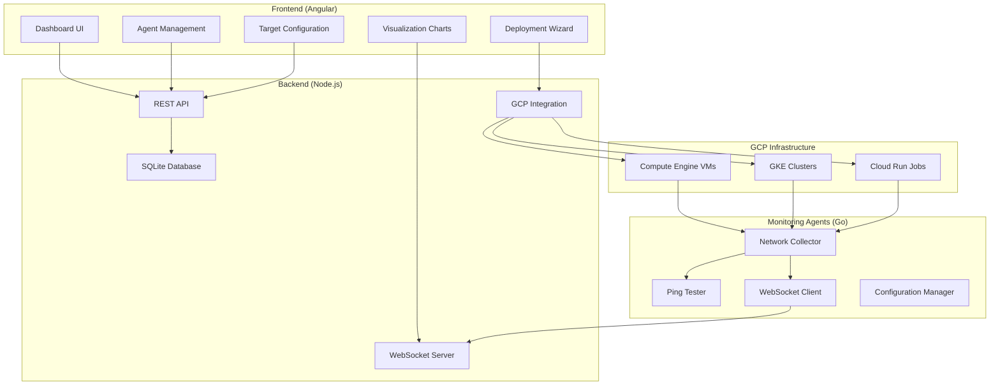

# Cloud Monitoring Agent System

A comprehensive network monitoring solution built with Angular frontend, Node.js backend, and Go monitoring agents that can be deployed across Google Cloud Platform.

## 🏗️ Architecture Overview



## 🚀 Quick Start

### Prerequisites

- Node.js 18+ and npm
- Go 1.21+
- Angular CLI 17+
- Google Cloud SDK
- Active GCP project with required APIs enabled

### 1. Backend Setup

```bash
cd backend
npm install
npm run start
```

The backend will start on port 3001 with:
- REST API endpoints at `/api/v1/*`
- WebSocket server at `/ws`
- SQLite database initialized automatically

### 2. Frontend Setup

```bash
npm install
ng serve
```

The Angular app will start on port 4200 with the monitoring dashboard accessible at `/monitoring`.

### 3. Build Monitoring Agent

```bash
cd monitoring-agent
go mod download
go build -o monitoring-agent ./cmd/agent
```

## 📊 Features

### Real-Time Dashboard
- System health overview with status indicators
- Network latency, packet loss, and throughput charts
- Connected agents display with real-time status updates
- Recent activity feed and system alerts
- WebSocket-powered live updates

### Agent Management
- Complete agent lifecycle management
- Real-time status monitoring with color-coded indicators
- Bulk operations (delete, configure, subscribe)
- Searchable and filterable agent list
- Detailed agent metrics and statistics

### GCP Deployment Integration
- **Compute Engine**: Deploy agents to VM instances with auto-startup scripts
- **Google Kubernetes Engine**: Deploy as Kubernetes pods with ConfigMaps
- **Cloud Run Jobs**: Deploy as scheduled jobs with custom configurations
- Cost estimation before deployment
- Deployment progress monitoring with real-time logs

### Target Configuration
- Configure ping targets (IP addresses, hostnames)
- Support for IPv4 and IPv6 targets
- Custom collection and transmission intervals
- Target health monitoring and alerting
- Bulk target management

### Advanced Visualization
- Interactive network latency charts with Chart.js
- Packet loss trending and analysis
- Network throughput monitoring (RX/TX)
- Historical data views with time range selection
- Real-time metric streaming

## 🛠️ Technical Components

### Frontend (Angular 17)
- **Framework**: Angular with Material Design
- **State Management**: RxJS observables and BehaviorSubjects
- **Charts**: Chart.js with ng2-charts integration
- **Real-time**: WebSocket client with automatic reconnection
- **Routing**: Lazy-loaded monitoring module

### Backend (Node.js)
- **Framework**: Express.js with TypeScript
- **Database**: SQLite with comprehensive schema
- **WebSocket**: ws library for real-time communication
- **Authentication**: JWT-based (optional)
- **APIs**: RESTful endpoints with OpenAPI documentation

### Monitoring Agents (Go)
- **CLI**: Cobra command-line interface
- **Configuration**: Viper YAML configuration management
- **Networking**: gopsutil for system metrics collection
- **Connectivity**: Custom ping implementation with statistics
- **Communication**: WebSocket client with auto-reconnection

### Database Schema
```sql
-- Agents table
CREATE TABLE agents (
    id TEXT PRIMARY KEY,
    provider TEXT NOT NULL,
    region TEXT NOT NULL,
    zone TEXT,
    instance_id TEXT,
    ip_address TEXT NOT NULL,
    version TEXT NOT NULL,
    status TEXT DEFAULT 'disconnected',
    capabilities TEXT,
    connected_at DATETIME,
    last_seen DATETIME,
    total_messages INTEGER DEFAULT 0,
    total_metrics INTEGER DEFAULT 0,
    total_errors INTEGER DEFAULT 0,
    created_at DATETIME DEFAULT CURRENT_TIMESTAMP,
    updated_at DATETIME DEFAULT CURRENT_TIMESTAMP
);

-- Metrics table
CREATE TABLE metrics (
    id INTEGER PRIMARY KEY AUTOINCREMENT,
    agent_id TEXT NOT NULL,
    name TEXT NOT NULL,
    type TEXT NOT NULL,
    value TEXT NOT NULL,
    unit TEXT,
    tags TEXT,
    timestamp DATETIME DEFAULT CURRENT_TIMESTAMP,
    FOREIGN KEY (agent_id) REFERENCES agents (id)
);

-- Additional tables for configurations, targets, and alert rules
```

## 🌐 API Documentation

### REST Endpoints

#### Agents
- `GET /api/v1/agents` - List all agents with filtering
- `GET /api/v1/agents/:id` - Get agent details
- `PUT /api/v1/agents/:id/config` - Update agent configuration
- `DELETE /api/v1/agents/:id` - Delete agent
- `GET /api/v1/agents/:id/stats` - Get agent statistics

#### Metrics
- `GET /api/v1/metrics` - Query metrics with filters
- `GET /api/v1/metrics/aggregated` - Get aggregated metrics
- `GET /api/v1/metrics/history` - Get historical data

#### Dashboard
- `GET /api/v1/dashboard/overview` - System overview
- `GET /api/v1/dashboard/metrics` - Dashboard chart data

#### GCP Deployment
- `GET /api/v1/gcp/regions` - List GCP regions
- `GET /api/v1/gcp/regions/:region/zones` - List zones
- `GET /api/v1/gcp/regions/:region/machine-types` - List machine types
- `POST /api/v1/gcp/deploy` - Deploy new agent
- `GET /api/v1/gcp/deployments` - List deployments
- `GET /api/v1/gcp/deployments/:id` - Get deployment status

### WebSocket Events

#### Client → Server
```json
{
  "type": "client_connect",
  "data": { "clientType": "dashboard" }
}

{
  "type": "subscribe_agent",
  "data": { "agent_id": "agent-123" }
}

{
  "type": "request_metrics",
  "data": { "agent_id": "agent-123", "metric_type": "latency" }
}
```

#### Server → Client
```json
{
  "type": "agent_connected",
  "data": { /* Agent object */ },
  "timestamp": "2024-06-10T12:00:00Z"
}

{
  "type": "metric_received",
  "data": { /* Metric object */ },
  "timestamp": "2024-06-10T12:00:00Z"
}

{
  "type": "system_alert",
  "data": { "severity": "warning", "message": "High latency detected" },
  "timestamp": "2024-06-10T12:00:00Z"
}
```

## 📈 Metrics Collected

### Network Interface Metrics
- **tx_bytes**: Transmitted bytes
- **rx_bytes**: Received bytes
- **tx_packets**: Transmitted packets
- **rx_packets**: Received packets
- **tx_errors**: Transmission errors
- **rx_errors**: Reception errors
- **tx_dropped**: Dropped transmitted packets
- **rx_dropped**: Dropped received packets

### Connectivity Metrics
- **rtt_min**: Minimum round-trip time
- **rtt_max**: Maximum round-trip time
- **rtt_avg**: Average round-trip time
- **rtt_stddev**: Round-trip time standard deviation
- **packet_loss**: Packet loss percentage

## 🚀 Deployment Options

### 1. Compute Engine Deployment
```bash
# Via UI deployment wizard
1. Navigate to /monitoring/deploy
2. Select "Compute Engine" deployment type
3. Configure region, zone, and machine type
4. Set agent configuration and targets
5. Deploy and monitor progress

# Via gcloud CLI
gcloud compute instances create monitoring-agent-vm \
  --zone=us-central1-a \
  --machine-type=e2-micro \
  --metadata-from-file startup-script=startup-script.sh
```

### 2. GKE Deployment
```yaml
apiVersion: apps/v1
kind: Deployment
metadata:
  name: monitoring-agent
spec:
  replicas: 3
  selector:
    matchLabels:
      app: monitoring-agent
  template:
    metadata:
      labels:
        app: monitoring-agent
    spec:
      containers:
      - name: monitoring-agent
        image: gcr.io/your-project/monitoring-agent:latest
        env:
        - name: BACKEND_URL
          value: "https://your-backend-url/api/v1"
        - name: WEBSOCKET_URL
          value: "wss://your-backend-url/ws"
```

### 3. Cloud Run Jobs
```yaml
apiVersion: run.googleapis.com/v1
kind: Job
metadata:
  name: monitoring-agent-job
spec:
  spec:
    template:
      spec:
        template:
          spec:
            containers:
            - image: gcr.io/your-project/monitoring-agent:latest
              env:
              - name: BACKEND_URL
                value: "https://your-backend-url/api/v1"
```

## 🔧 Configuration

### Agent Configuration (YAML)
```yaml
backend:
  url: "https://your-backend-url/api/v1"
  websocket_url: "wss://your-backend-url/ws"
  auth_token: "optional-jwt-token"

collection:
  interval: 30s
  transmission_interval: 60s
  batch_size: 100

targets:
  ping:
    - "8.8.8.8"
    - "1.1.1.1"
    - "google.com"
  dns:
    - "8.8.8.8"
    - "1.1.1.1"

filters:
  interfaces:
    - "eth0"
    - "ens4"
  metrics:
    - "network.*"
    - "connectivity.*"

log:
  level: info
  file: "/var/log/monitoring-agent.log"
```

### Environment Variables
```bash
# Backend Configuration
PORT=3001
NODE_ENV=production
DATABASE_URL=sqlite:./monitoring.db
LOG_LEVEL=info

# Frontend Configuration
BACKEND_URL=https://your-backend-url
WEBSOCKET_URL=wss://your-backend-url/ws
GOOGLE_CLIENT_ID=your-client-id
```

## 🔐 Security Features

- JWT-based authentication (optional)
- Rate limiting for API endpoints
- Input validation and sanitization
- CORS configuration
- Helmet.js security headers
- SQLite database with prepared statements
- Environment-based configuration
- Network security groups for GCP deployments

## 📊 Monitoring & Alerting

### Built-in Alerts
- Agent disconnection detection
- High network latency warnings
- Packet loss threshold alerts
- Failed deployment notifications
- Resource utilization monitoring

### Custom Alert Rules
```javascript
// Example alert rule configuration
{
  "name": "High Latency Alert",
  "condition": "avg(network.latency) > 100ms",
  "duration": "5m",
  "severity": "warning",
  "actions": ["webhook", "email"]
}
```

## 🛠️ Development

### Project Structure
```
├── src/app/components/monitoring/     # Angular monitoring module
│   ├── services/                     # API and WebSocket services
│   ├── metrics-dashboard/            # Main dashboard component
│   ├── agent-list/                   # Agent management
│   ├── agent-deploy/                 # GCP deployment wizard
│   ├── target-config/                # Target configuration
│   └── dialogs/                      # Modal dialogs
├── backend/                          # Node.js backend
│   ├── routes/                       # API route handlers
│   ├── services/                     # Business logic services
│   ├── database/                     # Database schemas and migrations
│   └── websocket/                    # WebSocket server
├── monitoring-agent/                 # Go monitoring agent
│   ├── cmd/agent/                    # CLI application
│   ├── internal/collectors/          # Metric collectors
│   ├── internal/connectivity/        # Connectivity testing
│   └── internal/client/              # WebSocket client
└── deployment/                       # Deployment configurations
    ├── docker/                       # Docker configurations
    ├── kubernetes/                   # K8s manifests
    └── terraform/                    # Infrastructure as code
```

### Build Commands
```bash
# Frontend
ng build --prod
ng test
ng lint

# Backend
npm run build
npm run test
npm run lint

# Monitoring Agent
go build -o monitoring-agent ./cmd/agent
go test ./...
go mod tidy
```

## 🔮 Future Enhancements

- **Multi-cloud Support**: AWS and Azure deployment options
- **Advanced Analytics**: Machine learning-based anomaly detection
- **Custom Dashboards**: User-configurable dashboard layouts
- **Integration APIs**: Webhook integrations with external systems
- **Mobile App**: React Native mobile dashboard
- **Advanced Alerting**: PagerDuty, Slack, and Teams integrations
- **Historical Analysis**: Long-term trend analysis and reporting
- **Compliance**: SOC 2 and GDPR compliance features

## 📚 Resources

- [Angular Documentation](https://angular.io/docs)
- [Chart.js Documentation](https://www.chartjs.org/docs/)
- [Node.js Best Practices](https://github.com/goldbergyoni/nodebestpractices)
- [Go Documentation](https://golang.org/doc/)
- [Google Cloud Platform](https://cloud.google.com/docs)

## 🤝 Contributing

1. Fork the repository
2. Create a feature branch
3. Make your changes
4. Add tests
5. Submit a pull request

## 📄 License

This project is licensed under the MIT License - see the [LICENSE](LICENSE) file for details.

---

**Built with ❤️ for cloud infrastructure monitoring** 